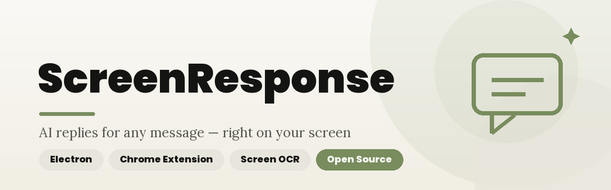

<p align="center">
  
</p>

<h1 align="center">ScreenResponse</h1>

<p align="center">
  AI-powered reply generator for emails, Slack, chat and more — a Grammarly-style
  floating widget for <b>macOS</b> and <b>Chrome</b>. Reads what's on your screen
  (screenshot + OCR or selected text) and drafts a reply in the right tone.
</p>

<p align="center">
  
  
  
  
</p>

---

## ✨ Features

**🖥️ macOS desktop app (Electron)**
- Floating, draggable widget that stays on top
- Screenshot + on-device **OCR** (Tesseract) to read text from any app
- Clipboard monitoring
- Global hotkeys (`Cmd+Shift+R`)
- System-tray integration

**🧩 Chrome extension**
- Detects selected text on any page
- Injected floating widget + right-click context menu
- Tuned for Gmail, Outlook, Slack, LinkedIn, X/Twitter, WhatsApp Web, Discord

**🤖 AI (OpenAI GPT)**
- Auto-detects the message type and tone (formal / casual / professional)
- Generates a smart reply, then refine it: *Shorter*, *More formal*, *Friendlier*…
- Multi-language (auto-detect)

## 🔑 API Key — bring your own

ScreenResponse ships **without any embedded API key**. You provide your own OpenAI
key, and it is stored **locally on your device** — never sent anywhere except OpenAI.

You can supply the key in any of these ways:

1. **In the app (recommended)** — open **Settings** in the Mac app, or the popup in the
   Chrome extension, and paste your key.
   - Mac app → stored via `electron-store` (local).
   - Chrome extension → stored via `chrome.storage.sync`.
2. **Environment variable (optional fallback)** — copy `.env.example` to `.env` and set
   `OPENAI_API_KEY`. See [`.env.example`](.env.example).

Get a key at <https://platform.openai.com/api-keys>.

> The optional video backend script (`mac-app/services/create_template.py`) uses a
> `RUNPOD_API_KEY` env var — only relevant if you deploy that serverless service.

## 🚀 Setup

### Prerequisites
- Node.js 18+
- npm

### Mac app
```bash
cd mac-app
npm install
npm start
```

### Chrome extension
1. Open `chrome://extensions/`
2. Enable **Developer mode** (top-right)
3. Click **Load unpacked** and select the `chrome-extension/` folder
4. Click the extension icon and paste your OpenAI API key

## 🎮 Usage

**Mac app**
- `Cmd+Shift+R` — capture the screen and extract text via OCR
- `Cmd+Shift+V` — use clipboard content
- `Esc` — hide the widget
- Click the tray icon to toggle the widget

**Chrome extension**
- Select text on any page, then click the floating button, **or**
- Right-click → **Generate AI Response**, **or** press `Ctrl/Cmd+Shift+R`

After a reply is generated you can tweak it with the quick-action buttons or your own
instruction (e.g. *"add a thank you", "make it more assertive"*).

## 🗂️ Project Structure

```
screenresponse/
├── mac-app/                 # Electron desktop app
│   ├── main.js              # Main process
│   ├── preload.js
│   ├── renderer/            # Widget UI
│   └── services/            # screenshot/OCR, clipboard, openai, detector, video
├── chrome-extension/        # Manifest V3 extension
│   ├── manifest.json
│   ├── background.js
│   ├── content.js
│   ├── popup/
│   └── floating/            # Injected widget
└── shared/                  # Shared prompts & OpenAI client
```

## 🔒 Privacy

- Your API key is stored locally and never sent to third parties.
- API calls go directly to OpenAI.
- No analytics, no telemetry, no data collection.

## 📦 Build (macOS)

```bash
cd mac-app
npm run build    # build a distributable
npm run pack     # package without an installer
```

## 📄 License

[MIT](LICENSE) © 2026 mcanince2
